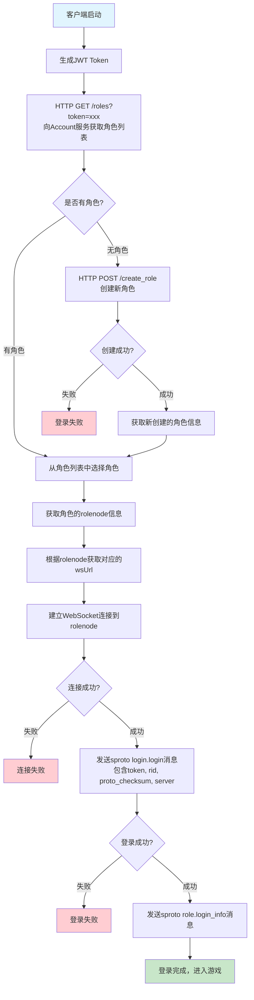
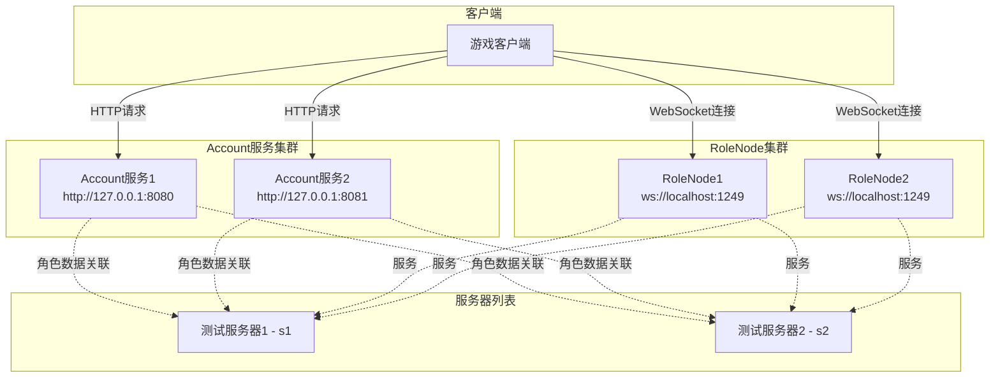
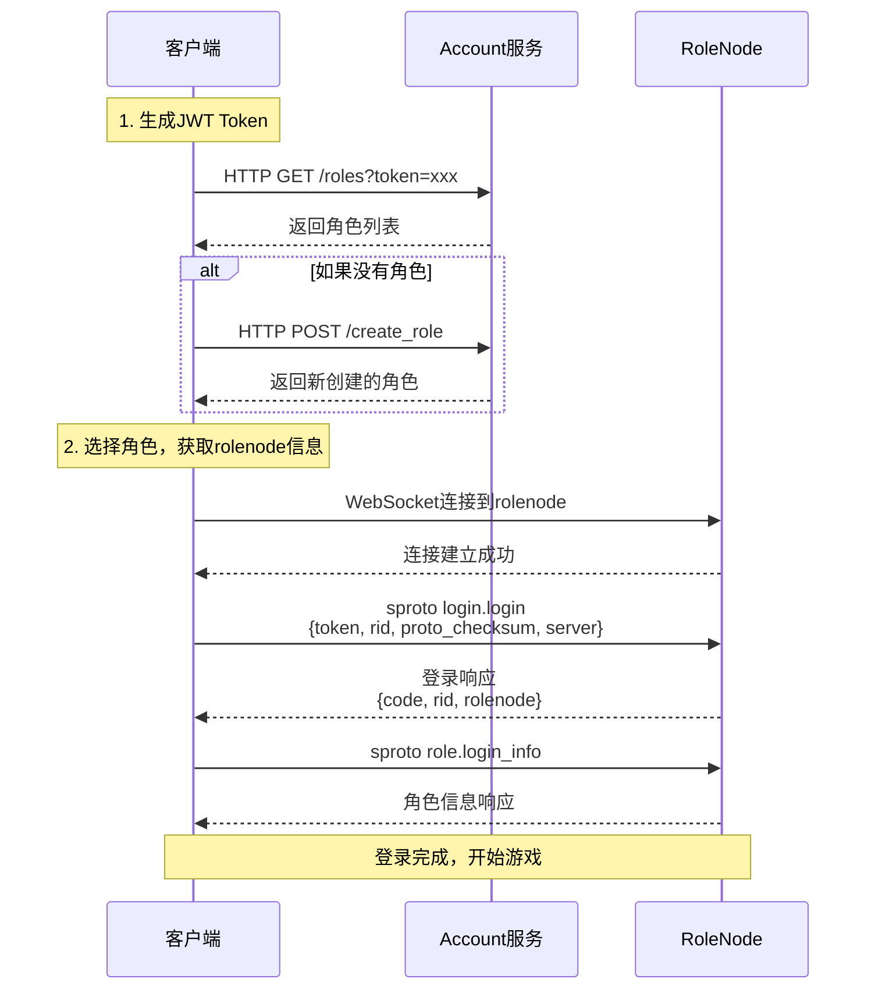

# 登录流程图

## 完整登录流程



## 服务架构图



## 协议交互时序图



## 关键数据结构

### JWT Token 结构
```json
{
  "account": "robot3"
}
```

### 角色信息结构
```json
{
  "rid": "角色ID",
  "rolenode": "rolenode1",
  "name": "角色名称",
  "server": "s1"
}
```

### 服务配置
```json
{
  "servers": {
    "s1": {"name": "测试服务器1", "server": "s1"},
    "s2": {"name": "测试服务器2", "server": "s2"}
  },
  "rolenodes": {
    "rolenode1": "ws://localhost:1249",
    "rolenode2": "ws://localhost:1249"
  },
  "account_hosts": [
    "http://127.0.0.1:8080",
    "http://127.0.0.1:8081"
  ]
}
```
