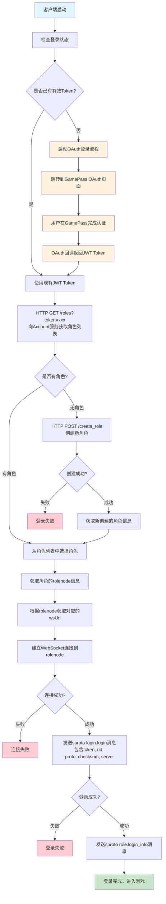
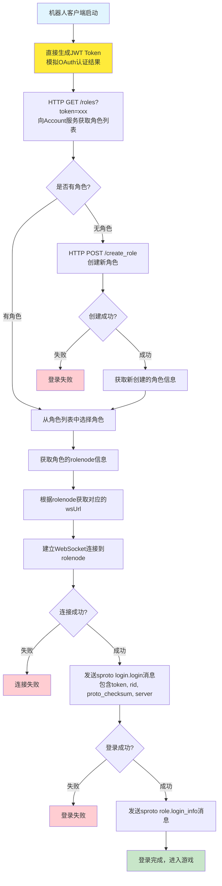
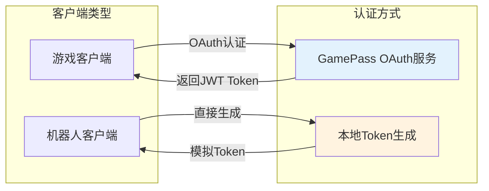
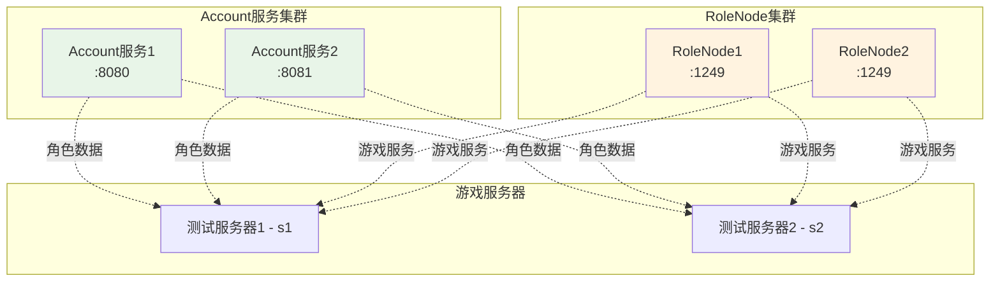
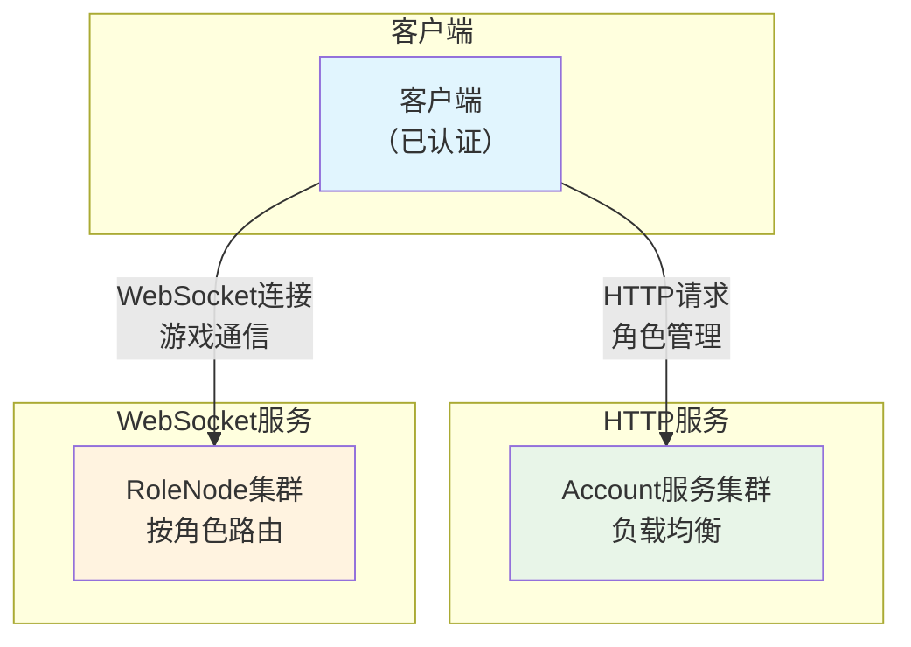
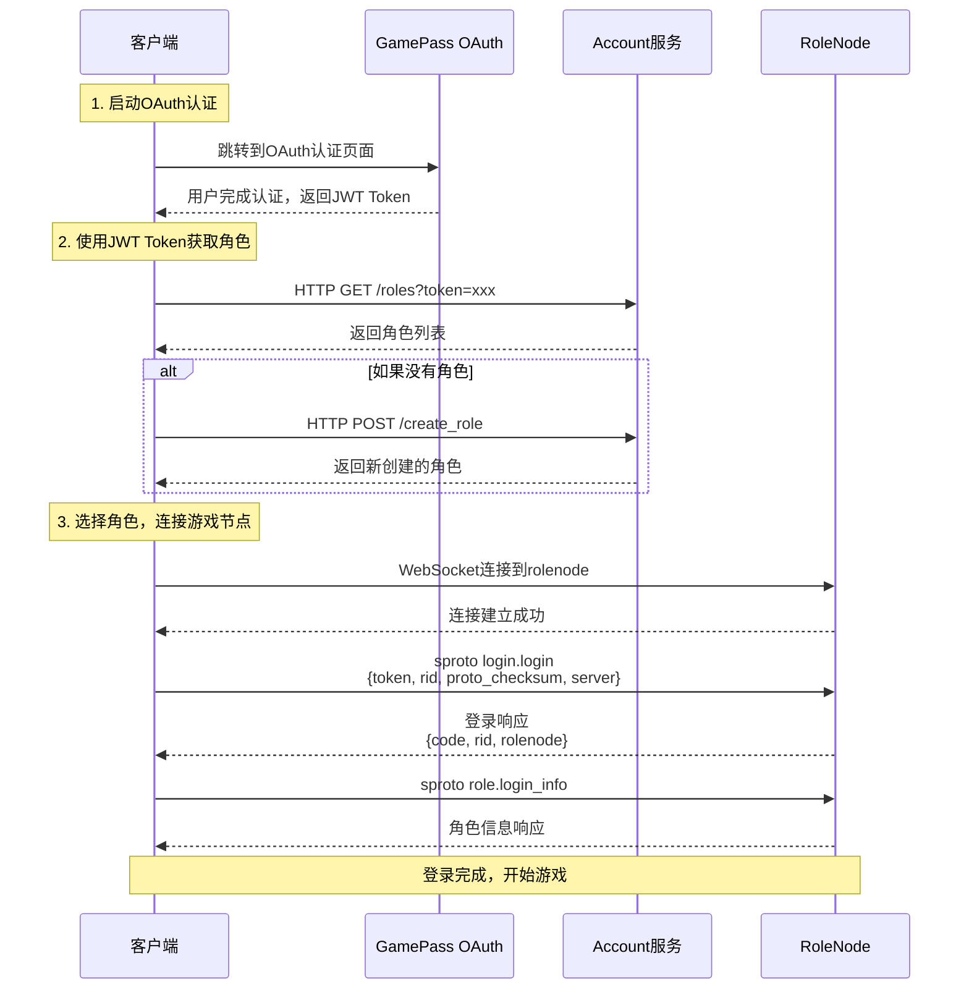
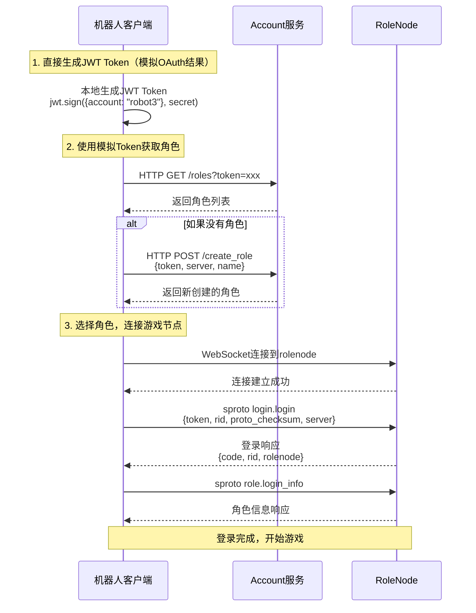

# 登录流程图

## 概述

本文档描述了游戏客户端的完整登录认证流程。系统支持两种认证方式：

1. **正常客户端OAuth认证**：通过GamePass OAuth服务进行用户身份认证，获取JWT Token
2. **机器人客户端模拟认证**：为了测试和自动化需求，机器人客户端直接生成JWT Token，跳过OAuth流程

## 完整登录流程（正常客户端）



## 机器人客户端简化流程



## 服务架构图

### 认证架构图



### 服务集群架构图



### 客户端连接架构图



## 协议交互时序图

### 正常客户端OAuth认证流程



### 机器人客户端简化认证流程



## 关键数据结构

### JWT Token 结构

#### 正常客户端（通过GamePass OAuth获取）
```json
{
  "account": "user_account_id",
  "sub": "user_subject_id",
  "iat": 1638360000,
  "exp": 1638363600,
  "iss": "gamepass_oauth_service",
  "aud": "game_client"
}
```

#### 机器人客户端（本地生成，仅用于测试）
```json
{
  "account": "robot3"
}
```

### OAuth认证流程数据

#### OAuth回调参数
```json
{
  "access_token": "eyJhbGciOiJIUzUxMiIsInR5cCI6IkpXVCJ9...",
  "refresh_token": "refresh_token_string",
  "token_type": "Bearer",
  "expires_in": 3600
}
```

#### OAuth错误响应
```json
{
  "error": "access_denied",
  "error_description": "用户拒绝授权"
}
```

### 角色信息结构
```json
{
  "rid": "角色ID",
  "rolenode": "rolenode1",
  "name": "角色名称",
  "server": "s1"
}
```

### Account服务API

#### 获取角色列表
```
GET /roles?token=jwt_token_string
Response: {
  "code": 0,
  "roles": [角色信息数组]
}
```

#### 创建角色
```
POST /create_role
Body: {
  "token": "jwt_token_string",
  "server": "s1",
  "name": "角色名称"
}
Response: {
  "code": 0,
  "role": 角色信息对象
}
```

### 服务配置
```json
{
  "servers": {
    "s1": {"name": "测试服务器1", "server": "s1"},
    "s2": {"name": "测试服务器2", "server": "s2"}
  },
  "rolenodes": {
    "rolenode1": "ws://localhost:1249",
    "rolenode2": "ws://localhost:1249"
  },
  "account_hosts": [
    "http://127.0.0.1:8080",
    "http://127.0.0.1:8081"
  ],
  "oauth_config": {
    "gamepass_base_url": "https://gamepass.example.com",
    "client_id": "game_client_id",
    "redirect_uri": "https://game.example.com/oauth/callback"
  }
}
```
